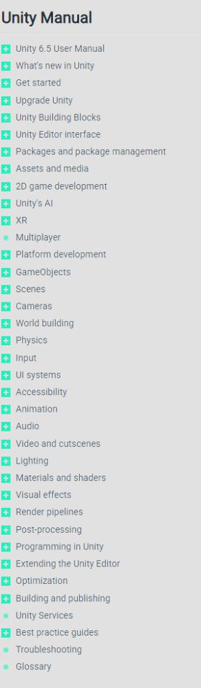

# 🎮 Guía Interactiva de Unity & C# (Manual Oficial & Referencia Rápida)

Una aplicación web moderna, interactiva y dinámica diseñada para aprender, comprender y consultar rápidamente **cada concepto, función y sección del Manual de Usuario oficial de Unity** (`docs.unity3d.com`), el paquete `com.unity.ai.assistant` y estructuras avanzadas de C#.

---

## 📱 Menú Principal de la Aplicación Web

En el menú principal de la aplicación web se muestran todos los bloques de contenido organizados en tarjetas individuales por colores, con un contador en vivo de conceptos y el buscador en tiempo real en la esquina superior derecha:


---

## 📘 Mapeo con la Estructura Oficial del Manual de Unity
Cada tarjeta del menú principal corresponde con las secciones del árbol oficial de navegación de Unity (`docs.unity3d.com/Manual/index.html`):



---

## 🌟 Características Principales

### 🔍 1. Buscador en Tiempo Real (Arriba a la Derecha)
- Ubicado en la esquina superior derecha de la pantalla.
- Permite buscar de forma instantánea cualquier función, método, concepto o palabra clave (`OnCollisionEnter`, `AddForce`, `ReadValue`, `ScriptableObject`, `Switch Expressions`, etc.).
- Resalta visualmente los términos coincidentes dentro de las tarjetas.

### 📋 2. Fragmentos C# Directos para Copiar y Pegar
- **Sin duplicación de clases**: Los fragmentos de código están diseñados para mostrar **únicamente el contenido directo de la función o método**.
- Puedes copiar directamente el código y pegarlo dentro de tus propios scripts existentes en Unity sin que cause errores de clase duplicada.
- Incluye botón **`📋 Copiar Código`** que confirma al instante cuando el fragmento se copia al portapapeles.

### 🌐 3. Sincronización en Tiempo Real con la Web Oficial de Unity
- Incluye el botón **`🔄 Sincronizar con Web Oficial`** que consulta `docs.unity3d.com` y guarda el estado en `localStorage`.
- Muestra un indicador en vivo (`🟢 Sincronizado con docs.unity3d.com`).
- Dentro de cada modal interactivo se incluye un enlace directo:
  > `🔗 Ver [NombreFuncion] en la documentación oficial (docs.unity3d.com) ➔`

### ⚡ 4. Condicionales Modernos C# 8+ / C# 9+
- Incluye un bloque completo dedicado a estructuras avanzadas de C#:
  - **Switch Expressions** (`itemRarity switch { ... }`).
  - **Type Pattern Matching** (`if (obj is IDamageable target)`).
  - **Rangos y Patrones Relacionales** (`> 30f and < 80f`).
  - **Property Pattern Matching** (`if (controller is { isGrounded: true })`).
  - **Operadores Nulos** (`??`, `??=`, `?.`).

### 🎨 5. Diseño Oscuro Premium & Interfaz Visual por Bloques
- Tarjetas separadas visualmente con colores temáticos e iconos distintivos.
- Indicador numérico que muestra la cantidad exacta de conceptos disponibles por categoría.
- Ventana modal interactiva con fondo difuminado (glassmorphism), explicación clara de **Qué Hace**, **Cuándo Usarlo**, **Consejo Pro** y código coloreado con sintaxis C#.

---

## 📂 Estructura del Proyecto

```
Ayudas Clara Unity/
├── index.html        # Estructura semántica HTML5 con buscador, tarjetas y modal
├── estilos.css       # Sistema de diseño visual oscuro premium y animaciones
├── datos.js          # Base de datos completa con más de 40 categorías y 100+ conceptos
├── app.js            # Lógica de búsqueda, filtrado, modal, sintaxis C# y sincronización
├── menu_principal.png # Captura de pantalla de la app web con sus tarjetas por bloques
├── manual_oficial.png # Referencia de la estructura oficial de Unity Manual
└── README.md         # Documentación y guía de uso del proyecto
```

---

## 📚 Categorías y Secciones Incluidas (Mapa 1 a 1 del Manual)

1. 🔀 **CONDICIONALES Y OPERADORES (C#)** (*If, Switch Expressions, Pattern Matching, Operadores Nulos*)
2. 📊 **TIPOS DE VARIABLES Y DATOS (C#)** (*Primitivos, Vector3, List<T>, Dictionary, Enum*)
3. 🔒 **MODIFICADORES DE ACCESO Y ESTADOS (C#)** (*public, private, [SerializeField], static*)
4. ⭐ **EVENTOS, HERENCIA E INTERFACES (C#)** (*Action events, Interfaces, Singleton*)
5. 🚀 **GET STARTED** (*Instalación y plantillas de proyecto*)
6. ⬆️ **UPGRADE UNITY** (*Migración de proyectos y API Updater*)
7. 🧰 **UNITY BUILDING BLOCKS** (*Sistemas modulares preconstruidos*)
8. 🖥️ **UNITY EDITOR INTERFACE** (*Hierarchy, Scene View e Inspector*)
9. 📦 **PACKAGES AND PACKAGE MANAGEMENT** (*Package Manager*)
10. 📄 **ASSETS AND MEDIA** (*ScriptableObjects y Addressables*)
11. 🕹️ **2D GAME DEVELOPMENT** (*Sprites, Tilemaps, 2D Physics*)
12. 🤖 **UNITY'S AI** (*Asistente de IA de Unity `com.unity.ai.assistant` y Sentis*)
13. 🥽 **XR (REALIDAD VIRTUAL Y AUMENTADA)** (*XR Interaction Toolkit y AR Foundation*)
14. 🌐 **MULTIPLAYER** (*Netcode for GameObjects, ServerRpc, ClientRpc*)
15. 📱 **PLATFORM DEVELOPMENT** (*Android, iOS, PC, Consolas y WebGL*)
16. 🧩 **GAMEOBJECTS** (*GetComponent, TryGetComponent, SetActive*)
17. 🗺️ **SCENES** (*SceneManager.LoadSceneAsync y DontDestroyOnLoad*)
18. 🎥 **CAMERAS** (*Cámaras, FOV y Cinemachine*)
19. 🏔️ **WORLD BUILDING** (*Terrain, ProBuilder, Splines, Occlusion Culling*)
20. 💥 **PHYSICS** (*Rigidbody, Raycast, Colliders, Joints, CharacterController*)
21. 🎮 **INPUT** (*Nuevo Input System, Action Maps y PlayerInput*)
22. 🖥️ **UI SYSTEMS** (*UI Toolkit, UXML/USS, uGUI Canvas y RectTransform*)
23. ♿ **ACCESSIBILITY** (*Subtítulos, remapeo de teclas y daltonismo*)
24. 🕺 **ANIMATION** (*Animator, Blend Trees, Animation Events e IK*)
25. 🔊 **AUDIO** (*AudioSource, AudioMixer, Spatial Audio 3D y Filtros DSP*)
26. 🎬 **VIDEO AND CUTSCENES** (*Timeline y VideoPlayer*)
27. ☀️ **LIGHTING** (*Luces, Baked Lightmaps, Light Probes y Reflection Probes*)
28. 🎨 **MATERIALS AND SHADERS** (*Materiales PBR y Shader Graph*)
29. ✨ **VISUAL EFFECTS** (*Particle System, VFX Graph, Trails y Decals*)
30. 👓 **RENDER PIPELINES** (*URP, HDRP y SRP Architecture*)
31. 🎞️ **POST-PROCESSING** (*Bloom, Vignette, Volume profiles*)
32. 📐 **PROGRAMMING IN UNITY** (*Ciclo de vida MonoBehaviour, Mathf, Corrutinas, Awaitable*)
33. 🛠️ **EXTENDING THE UNITY EDITOR** (*[MenuItem] e Inspector personalizado*)
34. ⚡ **OPTIMIZATION** (*Profiler, Garbage Collector, Batching*)
35. 📲 **BUILDING AND PUBLISHING** (*Compilación y ejecutable final*)
36. ☁️ **UNITY SERVICES** (*Cloud Save, Analytics y Ads*)
37. 💡 **BEST PRACTICE GUIDES** (*Patrones de arquitectura limpia*)
38. 🔧 **TROUBLESHOOTING** (*Diagnóstico y solución de errores de consola*)
39. 📖 **GLOSSARY** (*Diccionario técnico oficial*)

---

## 🚀 Cómo Ejecutar la Aplicación

1. Haz doble clic en el archivo **`index.html`** para abrirlo directamente en tu navegador habitual (Chrome, Edge, Firefox, Brave).
2. *(Opcional)* Si deseas ejecutarlo con un servidor local, puedes usar Python desde la carpeta del proyecto:
   ```bash
   python -m http.server 8080
   ```
   Luego abre en tu navegador `http://localhost:8080`.

---

## 💡 Cómo Utilizar la Guía

1. **Búsqueda Rápida**: Escribe cualquier término en el buscador superior derecho (ejemplo: `OnCollisionEnter` o `switch`).
2. **Exploración por Categorías**: Selecciona una categoría específica en el desplegable para ver solo sus funciones.
3. **Ver Detalles y Código**: Haz clic en cualquier ítem para abrir la ventana modal.
4. **Copiar y Pegar**: Haz clic en **`📋 Copiar Código`** para llevarte el snippet C# a tu script en Unity.
5. **Consultar Web Oficial**: Haz clic en el enlace inferior del modal para abrir la documentación oficial en `docs.unity3d.com`.

---

*Proyecto desarrollado con HTML5, CSS3 Vanilla, JavaScript ES6+, diseño responsivo y en idioma español.*
