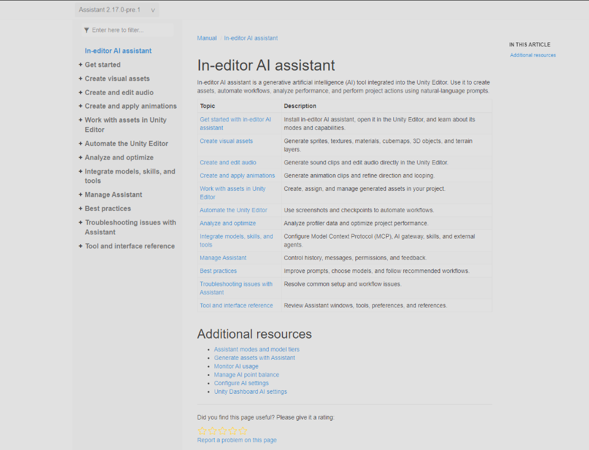

# 🎮 Guía Interactiva de Unity & C# (Manual Oficial & Referencia Rápida)

Una aplicación web moderna, interactiva y dinámica diseñada para aprender, comprender y consultar rápidamente **cada concepto, función y sección del Manual de Usuario oficial de Unity** (`docs.unity3d.com`), los portales oficiales de **Monetización** (`docs.unity.com/en-us/monetization`), **Adquisición de Jugadores** (`docs.unity.com/en-us/user-acquisition`), el paquete `com.unity.ai.assistant` y estructuras avanzadas de C#.

---

## 📱 Menú Principal de la Aplicación Web

En el menú principal de la aplicación web se muestran todos los bloques de contenido organizados en tarjetas individuales por colores, con un contador en vivo de conceptos y el buscador en tiempo real en la esquina superior derecha:



---

## 🌳 Árbol Interactivo de Navegación de la Documentación (GitHub Interactive Tree)

Despliega cualquier nodo haciendo clic en **`▶`** para explorar la jerarquía completa partiendo desde **`🎮 Unity Documentation`**:

```mermaid
graph TD
    Root["🎮 Unity Documentation"] --> CS["⚙️ C# & Programación Avanzada"]
    Root --> Manual["📘 Unity User Manual (docs.unity3d.com)"]
    Root --> Business["💰 Monetización & Adquisición (docs.unity.com)"]
    
    CS --> CS1["🔀 Condicionales y Operadores"]
    CS --> CS2["📊 Tipos de Variables y Datos"]
    CS --> CS3["🔒 Modificadores de Acceso"]
    CS --> CS4["⭐ Eventos, Herencia e Interfaces"]

    Manual --> M1["🚀 Inicio & Editor (Get Started, Editor Interface, Building Blocks)"]
    Manual --> M2["📦 Sistemas Core (GameObjects, Prefabs, Scenes, Assets, Packages)"]
    Manual --> M3["🕹️ 2D & Físicas (2D Game Dev, Physics 3D, Input System)"]
    Manual --> M4["🖥️ Gráficos & UI (UI Systems, Lighting, Shaders, VFX, Pipelines, Post-Processing)"]
    Manual --> M5["🕺 Animación, Audio & Vídeo (Animation, Audio, Video Cutscenes)"]
    Manual --> M6["🤖 IA, XR & Servicios (Unity AI, XR/AR, Multiplayer, Cloud Services)"]
    Manual --> M7["⚡ Optimización & Publicación (Optimization, Extending Editor, Building, Troubleshooting, Glosario)"]

    Business --> B1["💰 Unity Monetization (IAP, Ads, LevelPlay, Offerwall)"]
    Business --> B2["📈 Unity User Acquisition (UA Campaigns, ROAS, Playable Ads)"]
```



---

<details open>
<summary><h2>🎮 <b>Unity Documentation (Árbol Desplegable Interactivo)</b></h2></summary>

<br>

<details>
<summary><h3>⚙️ <b>1. C# & Programación Avanzada</b></h3></summary>

<ul>
  <li>
    <details>
      <summary><b>🔀 Condicionales y Operadores (C# 8/9+)</b></summary>
      <ul>
        <li><code>if / else if / else</code> — Evaluación condicional básica</li>
        <li><code>switch / case / default</code> — Selección por casos clásicos</li>
        <li><code>Switch Expressions (C# 8+)</code> — <code>variable switch { opcion => valor, _ => default }</code></li>
        <li><code>Type Pattern Matching</code> — <code>if (objeto is IDamageable objetivo)</code></li>
        <li><code>Rangos y Patrones Relacionales</code> — <code>switch { >= 80f => "Lleno", > 30f and < 80f => "Medio" }</code></li>
        <li><code>Property Pattern Matching</code> — <code>if (controller is { isGrounded: true })</code></li>
        <li><code>Operador Ternario</code> — <code>variable = (condicion) ? true : false;</code></li>
        <li><code>Operadores Nulos</code> — <code>??</code>, <code>??=</code>, <code>?.</code></li>
      </ul>
    </details>
  </li>
  <li>
    <details>
      <summary><b>📊 Tipos de Variables y Datos</b></summary>
      <ul>
        <li><code>Tipos Primitivos</code> — <code>int</code>, <code>float</code>, <code>bool</code>, <code>string</code></li>
        <li><code>Vectores & Rotaciones</code> — <code>Vector3</code>, <code>Vector2</code>, <code>Quaternion</code></li>
        <li><code>Colecciones</code> — <code>Array (int[])</code> vs <code>List&lt;T&gt;</code></li>
        <li><code>Dictionary&lt;TKey, TValue&gt;</code> — Tablas clave-valor de búsqueda instantánea</li>
        <li><code>Enum</code> — Enumeraciones personalizadas para estados</li>
      </ul>
    </details>
  </li>
  <li>
    <details>
      <summary><b>🔒 Modificadores de Acceso y Estados</b></summary>
      <ul>
        <li><code>public / private / protected</code> — Niveles de visibilidad y encapsulación</li>
        <li><code>[SerializeField] / [HideInInspector]</code> — Visibilidad en el Inspector de Unity</li>
        <li><code>static</code> — Variables y métodos compartidos entre todas las instancias</li>
        <li><code>readonly / const</code> — Constantes e inmutabilidad de datos</li>
        <li><code>Atributos del Inspector</code> — <code>[Header]</code>, <code>[Tooltip]</code>, <code>[Range]</code></li>
      </ul>
    </details>
  </li>
  <li>
    <details>
      <summary><b>⭐ Eventos, Herencia e Interfaces</b></summary>
      <ul>
        <li><code>Eventos C# (Action / Delegados)</code> — Mensajería limpia sin acoplamiento</li>
        <li><code>Interfaces (interface IDamageable)</code> — Contratos universales para objetos</li>
        <li><code>Herencia (virtual / override)</code> — Clases madre e hijas reutilizables</li>
        <li><code>Patrón Singleton</code> — Instancia única global (<code>GestorJuego.Instance</code>)</li>
      </ul>
    </details>
  </li>
</ul>

</details>

<details>
<summary><h3>💰 <b>2. Monetización & Adquisición de Jugadores (docs.unity.com)</b></h3></summary>

<ul>
  <li>
    <details>
      <summary><b>💰 Unity Monetization (docs.unity.com/en-us/monetization)</b></summary>
      <ul>
        <li><code>Unity In-App Purchasing (IAP)</code> — Compras integradas de gemas, monedas, skins y pases de batalla</li>
        <li><code>Unity Ads (Rewarded & Interstitials)</code> — Monetización mediante anuncios en vídeo bonificados</li>
        <li><code>Unity LevelPlay (Mediación Publicitaria)</code> — Subasta eCPM en tiempo real entre múltiples redes de anuncios</li>
        <li><code>Unity Personalization & Dynamic Pricing</code> — Ajuste dinámico de ofertas según comportamiento de compra</li>
        <li><code>Ad Placements & Offerwall</code> — Muros de ofertas para ganar recompensas dentro del juego</li>
      </ul>
    </details>
  </li>
  <li>
    <details>
      <summary><b>📈 Unity User Acquisition (docs.unity.com/en-us/user-acquisition)</b></summary>
      <ul>
        <li><code>User Acquisition (UA) Campaigns</code> — Campañas promocionales para escalar descargas activas</li>
        <li><code>Optimización de ROAS (Return On Ad Spend)</code> — Algoritmos para atraer jugadores de alto valor publicitario</li>
        <li><code>Playable Ads (Anuncios Jugables HTML5)</code> — Demos interactivas dentro del anuncio para maximizar conversión</li>
        <li><code>Atribución & Tracking de Conversión</code> — Medición MMP (Adjust/AppsFlyer) del origen exacto de las descargas</li>
        <li><code>Creative Testing & A/B Testing</code> — Pruebas A/B automáticas de vídeos e iconos promocionales</li>
      </ul>
    </details>
  </li>
</ul>

</details>

<details>
<summary><h3>🚀 <b>3. Inicio, Editor & Prototipado</b></h3></summary>

<ul>
  <li><b>📘 Unity 6 User Manual</b> — Guía oficial de arquitectura del motor Unity 6</li>
  <li><b>✨ What's new in Unity</b> — GPU Resident Drawer, Render Graphs y Awaitable</li>
  <li><b>🚀 Get Started</b> — Unity Hub, licencias y plantillas de proyecto 2D/3D URP</li>
  <li><b>⬆️ Upgrade Unity</b> — API Updater y migración de proyectos antiguos</li>
  <li><b>🧰 Unity Building Blocks</b> — Componentes modulares de cámara, controles y luz</li>
  <li><b>🖥️ Unity Editor Interface</b> — Hierarchy, Inspector, Scene View, Game View y Console</li>
</ul>

</details>

<details>
<summary><h3>📦 <b>4. Arquitectura Core & Gestión de Assets</b></h3></summary>

<ul>
  <li><b>📦 Packages and Package Management</b> — Package Manager, Unity Registry y Git packages</li>
  <li><b>📄 Assets and Media</b> — Importación de modelos 3D, ScriptableObjects y Addressables</li>
  <li><b>🧩 GameObjects</b> — Componentes, <code>GetComponent</code>, <code>TryGetComponent</code>, <code>SetActive</code>, Tags y LayerMask</li>
  <li><b>🗺️ Scenes</b> — <code>SceneManager.LoadSceneAsync</code>, <code>DontDestroyOnLoad</code> y edición multiescena</li>
  <li><b>🎥 Cameras</b> — Camera Component, FOV, Cinemachine Virtual Cameras y Camera Stacking</li>
</ul>

</details>

<details>
<summary><h3>🕹️ <b>5. 2D & Físicas</b></h3></summary>

<ul>
  <li><b>🕹️ 2D Game Development</b> — Sprites, Tilemaps (Grid 2D), 2D Physics, 2D Lights y Sprite Shape</li>
  <li><b>💥 Physics (3D)</b> — Rigidbody, Colliders (Box, Sphere, Capsule, Mesh), <code>OnCollisionEnter</code>, <code>OnTriggerEnter</code>, <code>Physics.Raycast</code>, CharacterController, Physics Joints y PhysicMaterial</li>
  <li><b>🎮 Input</b> — Nuevo Input System, Action Maps, <code>ReadValue&lt;T&gt;()</code>, <code>WasPressedThisFrame()</code> y PlayerInput</li>
</ul>

</details>

<details>
<summary><h3>🖥️ <b>6. Gráficos, Iluminación & Interfaces (UI)</b></h3></summary>

<ul>
  <li><b>🖥️ UI Systems</b> — UI Toolkit, UXML/USS, UI Builder, <code>Q&lt;VisualElement&gt;()</code>, uGUI Canvas y RectTransform</li>
  <li><b>☀️ Lighting</b> — Light Component (Directional, Point, Spot, Area), Baked Lightmaps, Light Probes, Reflection Probes y Skybox Environment</li>
  <li><b>🎨 Materials and Shaders</b> — Materiales PBR Lit, Shader Graph visual, <code>Material.SetColor</code> y <code>Shader.PropertyToID</code></li>
  <li><b>✨ Visual Effects</b> — Particle System (CPU), VFX Graph (GPU), TrailRenderer y Decal Projector URP</li>
  <li><b>👓 Render Pipelines</b> — Universal Render Pipeline (URP), High Definition Render Pipeline (HDRP) y CommandBuffer</li>
  <li><b>🎞️ Post-Processing</b> — Volume Profile, Bloom, Color Grading, Vignette y Motion Blur</li>
</ul>

</details>

<details>
<summary><h3>🕺 <b>7. Animación, Audio & Cinemáticas</b></h3></summary>

<ul>
  <li><b>🕺 Animation</b> — Animation Clips, Animator Controller (Máquina de Estados), Blend Trees, Animation Events, Inverse Kinematics (IK) y Animation Rigging</li>
  <li><b>🔊 Audio</b> — AudioListener, Importación de Audios, AudioSource (2D/3D), AudioMixer, Filtros DSP (LowPass/Reverb) y Ambisonics VR</li>
  <li><b>🎬 Video and Cutscenes</b> — VideoPlayer Component, Timeline Sequencer y PlayableDirector</li>
</ul>

</details>

<details>
<summary><h3>🤖 <b>8. Inteligencia Artificial, VR & Servicios en la Nube</b></h3></summary>

<ul>
  <li><b>🤖 Unity's AI</b> — In-Editor AI Assistant (<code>com.unity.ai.assistant</code>), Generación de Sprites/Audio con Prompts y Unity Sentis (Inferencia Neural ONNX)</li>
  <li><b>🥽 XR (Realidad Virtual y Aumentada)</b> — XR Interaction Toolkit (Grab & Teleport), AR Foundation (ARSession & Plane Tracking) y Hand Tracking</li>
  <li><b>🌐 Multiplayer</b> — Netcode for GameObjects (NGO), NetworkVariable&lt;T&gt;, <code>ServerRpc</code>, <code>ClientRpc</code>, Relay y Lobby</li>
  <li><b>📱 Platform Development</b> — Adaptación de plataforma (<code>Application.platform</code>), PC, Android/iOS Touch, WebGL y Consolas</li>
  <li><b>☁️ Unity Services</b> — Unity Cloud Save API, Unity Analytics, Unity Ads (Rewarded Videos) y Unity Authentication</li>
</ul>

</details>

<details>
<summary><h3>⚡ <b>9. Optimización, Editor & Publicación</b></h3></summary>

<ul>
  <li><b>📐 Programming in Unity</b> — Ciclo de vida MonoBehaviour (Awake/Start/Update), Mathf, Corrutinas, Awaitable (Unity 6) y C# Job System</li>
  <li><b>🛠️ Extending the Unity Editor</b> — <code>[MenuItem]</code>, Custom Inspector GUI (<code>CustomEditor</code>) y EditorWindows</li>
  <li><b>⚡ Optimization</b> — Profiler Window, Recolección de Basura (GC), Occlusion Culling y Batching Estático/Dinámico</li>
  <li><b>📲 Building and Publishing</b> — Build Settings, Player Settings y <code>BuildPipeline.BuildPlayer</code></li>
  <li><b>♿ Accessibility</b> — Subtítulos, remapeo de teclas y modos para daltonismo</li>
  <li><b>💡 Best Practice Guides</b> — Arquitectura de código limpia, gestión de memoria y optimización de físicas</li>
  <li><b>🔧 Troubleshooting</b> — Diagnóstico de <code>NullReferenceException</code> y mensajes de consola</li>
  <li><b>📖 Glossary</b> — Diccionario de términos técnicos (Draw Calls, Mipmaps, Quaternions, Frustum Culling)</li>
</ul>

</details>

</details>

---

## 🌟 Características Principales

### 🔍 1. Buscador en Tiempo Real (Arriba a la Derecha)
- Ubicado en la esquina superior derecha de la pantalla.
- Permite buscar de forma instantánea cualquier función, método, concepto o palabra clave (`OnCollisionEnter`, `AddForce`, `ReadValue`, `ScriptableObject`, `Switch Expressions`, `Unity IAP`, `LevelPlay`, `ROAS`, etc.).
- Resalta visualmente los términos coincidentes dentro de las tarjetas.

### 📋 2. Fragmentos C# Directos para Copiar y Pegar
- **Sin duplicación de clases**: Los fragmentos de código están diseñados para mostrar **únicamente el contenido directo de la función o método**.
- Puedes copiar directamente el código y pegarlo dentro de tus propios scripts existentes en Unity sin que cause errores de clase duplicada.
- Incluye botón **`📋 Copiar Código`** que confirma al instante cuando el fragmento se copia al portapapeles.

### 🌐 3. Sincronización en Tiempo Real con la Web Oficial de Unity
- Incluye el botón **`🔄 Sincronizar con Web Oficial`** que consulta `docs.unity3d.com` y `docs.unity.com` guardando el estado en `localStorage`.
- Muestra un indicador en vivo (`🟢 Sincronizado con docs.unity3d.com`).
- Dentro de cada modal interactivo se incluye un enlace directo a la documentación oficial.

---

## 📂 Estructura del Proyecto

```
Ayudas Clara Unity/
├── index.html        # Estructura semántica HTML5 con buscador, tarjetas y modal
├── estilos.css       # Sistema de diseño visual oscuro premium y animaciones
├── datos.js          # Base de datos completa con más de 40 categorías y 100+ conceptos
├── app.js            # Lógica de búsqueda, filtrado, modal, sintaxis C# y sincronización
├── menu_principal.png # Captura de pantalla de la app web con sus tarjetas por bloques
├── manual_oficial.png # Referencia de la estructura oficial de Unity Manual
└── README.md         # Documentación y guía de uso con árbol interactivo desplegable
```

---

## 🚀 Cómo Ejecutar la Aplicación

1. Haz doble clic en el archivo **`index.html`** para abrirlo directamente en tu navegador habitual (Chrome, Edge, Firefox, Brave).
2. *(Opcional)* Si deseas ejecutarlo con un servidor local, puedes usar Python desde la carpeta del proyecto:
   ```bash
   python -m http.server 8080
   ```
   Luego abre en tu navegador `http://localhost:8080`.

---

*Proyecto desarrollado con HTML5, CSS3 Vanilla, JavaScript ES6+, diseño responsivo y en idioma español.*
